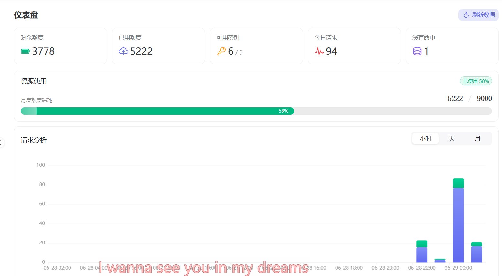
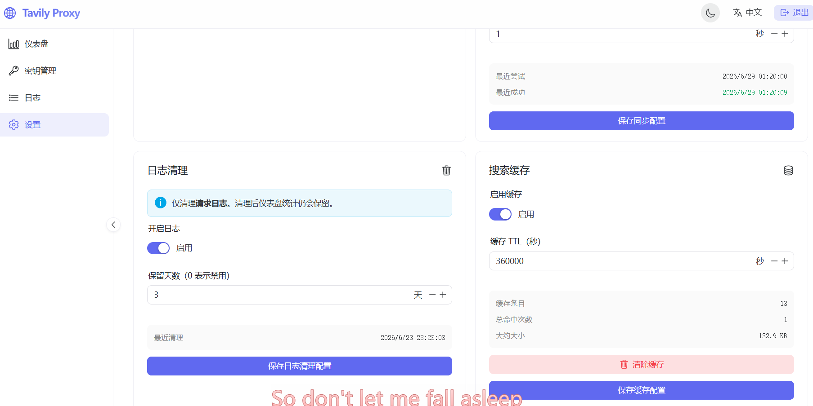

# Tavily Proxy Pool & MCP Endpoint

[简体中文](./README.md) | English

A reverse proxy for the Tavily API designed for **multi-agent shared Tavily key pools** — deploy once, let N AI agents share M Tavily keys with automatic rotation and failover.

---

## ✨ Core Features

- **6 MCP tools** (HTTP MCP endpoint, compatible with Claude Code / OpenClaw / Cursor / Cline / Continue):
  - `tavily-search` — real-time web search
  - `tavily-extract` — clean content extraction from URLs
  - `tavily-crawl` — full-site crawling
  - `tavily-map` — site structure mapping
  - `tavily-research` — deep research reports (async, internal polling)
  - `tavily-usage` — quota usage (local aggregation, zero credits)
- **Transparent proxy**: forwards all paths and methods to `https://api.tavily.com`.
- **Master Key authentication**: `Authorization: Bearer <MasterKey>`.
- **Intelligent key pool**:
  - Prioritizes keys with the highest remaining quota.
  - Random tie-breaking to avoid rate limiting.
  - Automatic failover on `401` / `429` / `432` / `433`.
- **Built-in dashboard** (Vite + Vue 3 + Naive UI):
  - Key management, usage charts, request logs, monthly auto-reset, log cleanup cron.


- **Search response cache** (SQLite):
  - Caches `POST /search` responses keyed on SHA256 of 6 fields: `query + search_depth + topic + max_results + include/exclude_domains`.
  - Cache hit → DB read, **0 credits, ~20ms response** (vs ~1-2s real Tavily, 50-100× speedup).
  - Ideal for multi-agent: identical queries from any agent hit cache after the first, slashing Tavily credit usage.


- **Single Go binary**, Docker-ready.

---

## 🌟 Recommended Usage: Multi-Agent Shared Key Pool

The **core use case** of this project — deploy one proxy, share M Tavily keys across N AI agents.

```
                  ┌─────────────────────────┐
                  │  TavilyProxyManager     │
                  │  https://your-host/mcp  │
                  │                         │
   ┌──────┐       │  ┌─────────────────┐    │      ┌──────────────┐
   │Agent1│──┐    │  │   Key Pool      │    │      │              │
   └──────┘  │    │  │  ┌──────┐       │    │      │              │
   ┌──────┐  ├────┼─►│  │Key A │─►─┐   │    │      │  api.tavily  │
   │Agent2│──┤    │  │  ├──────┤   ├►──┼────┼─────►│     .com      │
   └──────┘  │    │  │  │Key B │─►─┤   │    │      │              │
   ┌──────┐  │    │  │  ├──────┤   ├►──┘    │      │              │
   │Agent3│──┘    │  │  │Key C │─►─┘        │      │              │
   └──────┘       │  │  └──────┘            │      └──────────────┘
                  │  └─────────────────┘    │
   ┌──────┐       │                         │
   │Agent4│───────┤  Single Master Key      │
   └──────┘       │  Auto-rotate + failover │
   ┌──────┐       │                         │
   │ Agent…│──────┤  (N agents in parallel) │
   └──────┘       └─────────────────────────┘
```

**Benefits**:
- ✅ Each agent needs **zero Tavily keys** of its own
- ✅ One key failing/rate-limited → automatic failover, other agents unaffected
- ✅ M keys' quota **fairly shared** across N agents (dynamic by remaining quota)
- ✅ Single auth point: rotate Master Key once, all agents re-auth

**Integration example (Claude Code):**
```bash
claude mcp add --transport http tavily-pool \
  https://your-host/mcp \
  --header "Authorization: Bearer <MASTER_KEY>"
```

**Integration example (OpenClaw):**
```bash
openclaw mcp set tavily-pool '{"url":"https://your-host/mcp","transport":"streamable-http","headers":{"Authorization":"Bearer <MASTER_KEY>"},"timeout":300}'
```

---

## 🔧 Fork Improvements

Compared to upstream [xuncv/TavilyProxyManager](https://github.com/xuncv/TavilyProxyManager), this fork adds/fixes:

| Improvement | Description |
|---|---|
| **➕ `tavily-research` tool** | 6th MCP tool, deep research with async polling (2s interval, 5min cap) |
| **🔒 Bind to `127.0.0.1:8080`** | Container only listens on loopback by default — no public exposure |
| **🔒 Master Key not logged in plaintext** | Logs only hint at `/api/settings/master-key`, never print the actual key |
| **🔒 `register/` directory removed** | Upstream's bulk Tavily key registration script (Tavily TOS risk) — fully deleted here |
| **🛠 Schema aligned with Tavily real API** | All 6 tools' `inputSchema` enums verified against Tavily API live behaviour (e.g. `output_length: [short, standard, long]`, `citation_format: [numbered, mla, apa, chicago]`, `chunks_per_source: oneOf[1-5, "auto"]`) |
| **🐛 Candidates shuffle seed fix** | Replaced broken `time-based` seed with `math/rand/v2.Shuffle` (concurrent-safe, auto-seeded) |
| **🐛 Update() no longer forces `IsActive=false`** | Legal partial updates (quota, alias) no longer soft-disable a key |
| **🐛 Auto-sync concurrency no longer dead code** | Was hardcoded `concurrency := 1`, now reads `SettingAutoSyncConcurrency` from settings (configurable in dashboard) |
| **🐛 Research key pinning** | Tavily research tasks are per-key isolated (task created by KEY_A can only be polled by KEY_A). `addResearchTool` now pins the POST key and echoes it on every subsequent poll |

---

## 🚀 Quick Deployment (Docker)

### 1. Docker Compose (Recommended)

Create `docker-compose.yml`:

```yaml
services:
  tavily-proxy:
    image: ghcr.io/one2agi/tavilyproxymanager:latest
    container_name: tavily-proxy
    # ⚠️ Security: bind to loopback only, must pair with nginx/Caddy + HTTPS
    ports:
      - "127.0.0.1:8080:8080"
    environment:
      - LISTEN_ADDR=:8080
      - DATABASE_PATH=/app/data/proxy.db
      - TAVILY_BASE_URL=https://api.tavily.com
      # ⚠️ At least 100s for research tasks
      - UPSTREAM_TIMEOUT=100s
    volumes:
      - ./data:/app/data
      - /var/log/tavily-proxy:/var/log/tavily-proxy
    restart: unless-stopped
```

Start:
```bash
docker compose up -d
```

### 2. Local Build (after forking)

```bash
git clone https://github.com/one2agi/TavilyProxyManager.git
cd TavilyProxyManager
docker build -t tavily-proxy:custom .
docker compose up -d
```

---

## 🔑 First Run: Obtaining the Master Key

A random Master Key is auto-generated on **first startup** (for dashboard login and API auth).

**This fork's improvement**: the Master Key is **never printed in plaintext** in startup logs.

Recovery options (pick one):

**Option 1: SQLite query**
```bash
sqlite3 ./data/proxy.db "SELECT value FROM settings WHERE key='master_key'"
```

**Option 2: From the dashboard**
Visit `http://localhost:8080`, log in with initial credentials, then find the Master Key in Settings.

> ⚠️ **Security tip**: Store the Master Key in 1Password/Bitwarden. Never commit it to git.

---

## 🛠 Local Development

```bash
# Backend
go run ./server

# Frontend (separate terminal)
cd web && npm install && npm run dev
```

Binary builds:
- Windows: `.\scripts\build_all.ps1`
- Linux/macOS: `./scripts/build_all.sh`

---

## 📖 Usage Guide

### REST API Proxy

Call exactly as you would the official Tavily API — just swap the base URL and use your Master Key:

```bash
curl -X POST "http://localhost:8080/search" \
  -H "Authorization: Bearer <MASTER_KEY>" \
  -H "Content-Type: application/json" \
  -d '{"query": "Latest AI trends", "search_depth": "basic", "max_results": 5}'
```

### The 6 MCP Tools

| Tool | Capability | Key Parameters |
|---|---|---|
| `tavily-search` | Real-time web search (**with cache**) | `query`, `search_depth`, `topic`, `max_results`, `time_range`, `chunks_per_source` |
| `tavily-extract` | Extract clean content from URLs | `urls[]`, `extract_depth`, `format` (markdown/text/html_tags), `query` (rerank) |
| `tavily-crawl` | Crawl an entire site | `url`, `max_depth` (1-5), `max_breadth`, `limit` (≤1000) |
| `tavily-map` | Map site structure | `url`, `max_depth`, `max_breadth`, `limit` (≤1000) |
| `tavily-research` | Deep research (async) | `input`, `model` (mini/pro/auto), `output_length`, `citation_format` |
| `tavily-usage` | Quota usage | (no params, local aggregation) |

### MCP Integration Examples

**Claude Code:**
```bash
claude mcp add --transport http tavily-pool https://your-host/mcp \
  --header "Authorization: Bearer <MASTER_KEY>"
```

**Cursor** (`~/.cursor/mcp.json`):
```json
{
  "mcpServers": {
    "tavily-pool": {
      "url": "https://your-host/mcp",
      "headers": { "Authorization": "Bearer <MASTER_KEY>" }
    }
  }
}
```

**OpenClaw** (`openclaw mcp set`):
```bash
openclaw mcp set tavily-pool '{"url":"https://your-host/mcp","transport":"streamable-http","headers":{"Authorization":"Bearer <MASTER_KEY>"},"timeout":300}'
```

---

## ⚙️ Configuration (Environment Variables)

| Variable | Description | Default |
|---|---|---|
| `LISTEN_ADDR` | Server listen address | `:8080` |
| `DATABASE_PATH` | SQLite database path | `/app/data/proxy.db` |
| `TAVILY_BASE_URL` | Upstream Tavily API | `https://api.tavily.com` |
| `UPSTREAM_TIMEOUT` | Upstream timeout (≥ 100s for research) | `100s` |
| `MCP_STATELESS` | Stateless MCP mode (avoids `session not found`) | `true` |
| `MCP_SESSION_TTL` | MCP session idle timeout | `10m` |
| `LOG_DIR` | File log directory (empty = stdout only) | (empty) |
| `cache_enabled` | Enable search response cache (toggle in Settings) | `true` |
| `cache_ttl_seconds` | Cache entry TTL in seconds | `43200` (12h) |

---

## 🔒 Security Recommendations (Production)

This fork's defaults are hardened, but for production:

1. **Container only binds `127.0.0.1`** — no public exposure
2. **nginx / Caddy reverse proxy + HTTPS** with Let's Encrypt
3. **Reverse proxy must forward `Mcp-Session-Id`** (when using stateful MCP)
4. **Master Key in password manager**, rotated regularly
5. **fail2ban** to prevent brute-force
6. **Cloudflare proxy** for DDoS protection (optional)
7. **Never** put the Master Key in commit history / screenshots / docs

---

## 🆚 vs Upstream

| Feature | Upstream xuncv | This fork |
|---|---|---|
| 5 MCP tools | ✅ | ✅ |
| `tavily-research` tool | ❌ | ✅ |
| Schema aligned with Tavily API | ❌ (some fields wrong) | ✅ (live-verified) |
| Candidates shuffle seed | ❌ (time-based) | ✅ (math/rand/v2) |
| Update() doesn't force-disable | ❌ | ✅ |
| Auto-sync concurrency configurable | ❌ (dead code 1) | ✅ |
| Research key pinning | ❌ (per-key 404) | ✅ |
| Container binds to loopback | ❌ | ✅ |
| Master Key not logged in plaintext | ❌ | ✅ |
| `register/` bulk registration | ⚠️ (TOS risk) | ✅ removed |

---

## 📄 License

MIT License. Forked from [xuncv/TavilyProxyManager](https://github.com/xuncv/TavilyProxyManager).
